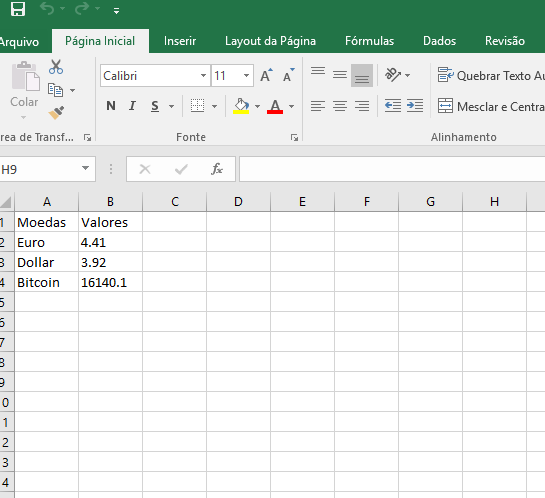

# Câmbio com Python

Um script para pegar os valores, via requisição web, das cotações das principais moedas mundiais:

- Dólar
- Euro
- Bitcoin

API Utilizada: [FIXER.IO] (https://fixer.io/)

# Bibliotecas para funcionamento do Script
```sh
pip install requests
pip install json
pip install pandas
```

# Arquivo gerado


# Desenvolvedor

- Marcos Scaramussa Jr

# Licença

- Software Livre (Free Software)
dd
